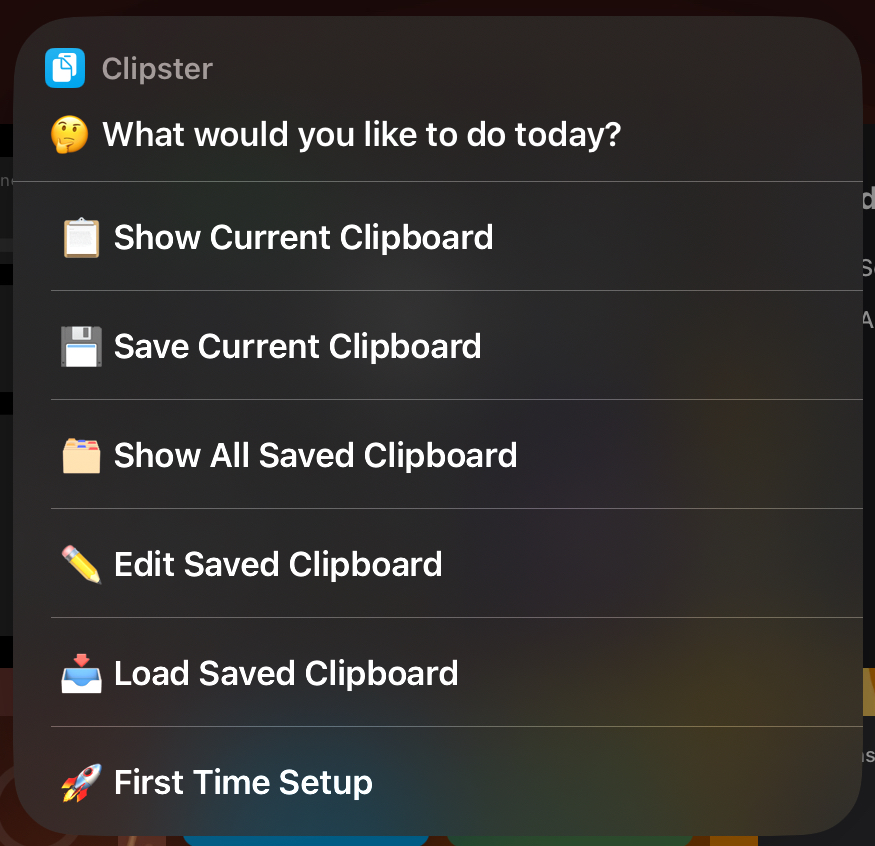

# Clipster 📋
Clipster is an easy to use and powerful ios shortcut app for managing text clipboards easily!

## Overview
My first ever “proper” ios shortcut
  
I created this shortcut because it's hard to find a free clipboard manager on ios that's not littered with ads, so I decided to create one for myself

## Installing

[Routinehub](https://routinehub.co/shortcut/17960/)

[Shareshortcuts](https://shareshortcuts.com/shortcuts/2705-clipster.html)

[Direct](https://www.icloud.com/shortcuts/f9ad73bbea6e4531bb613103b206b9ff)

## Screenshots
Menu|Show All Saved Clipboards Option
:-------------------------:|:-------------------------:
  |  

## Contributions
All contributions are welcome!

If you face any issues or have a recommendation for a feature, don't hesitate to open a new issue

Thanks 😊
- Fandrest (TheXploler)
